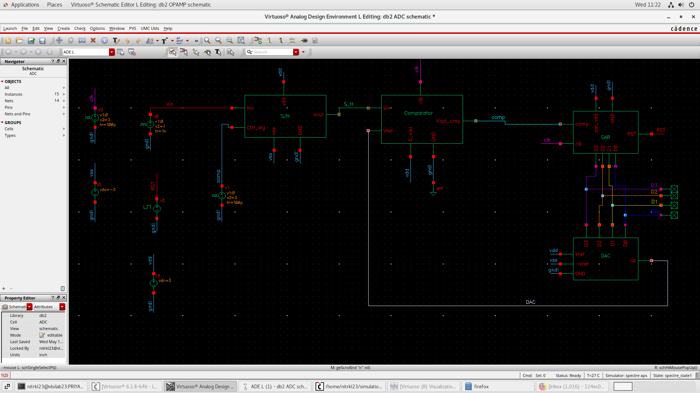
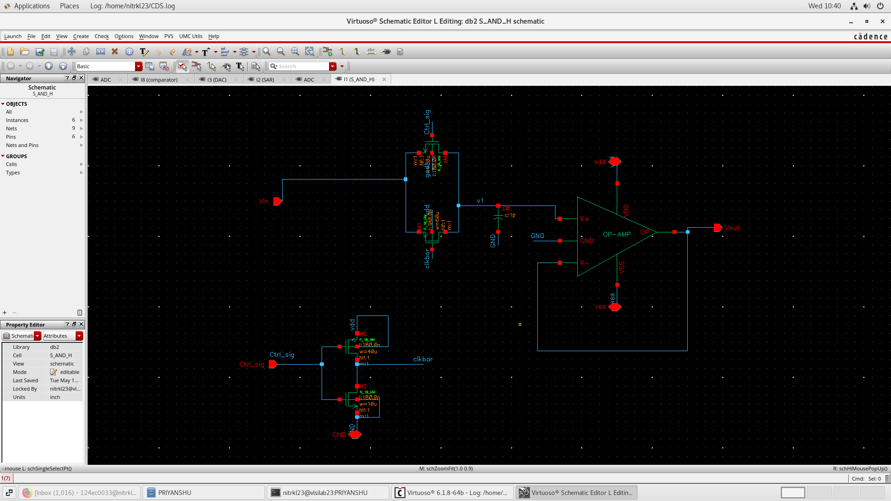
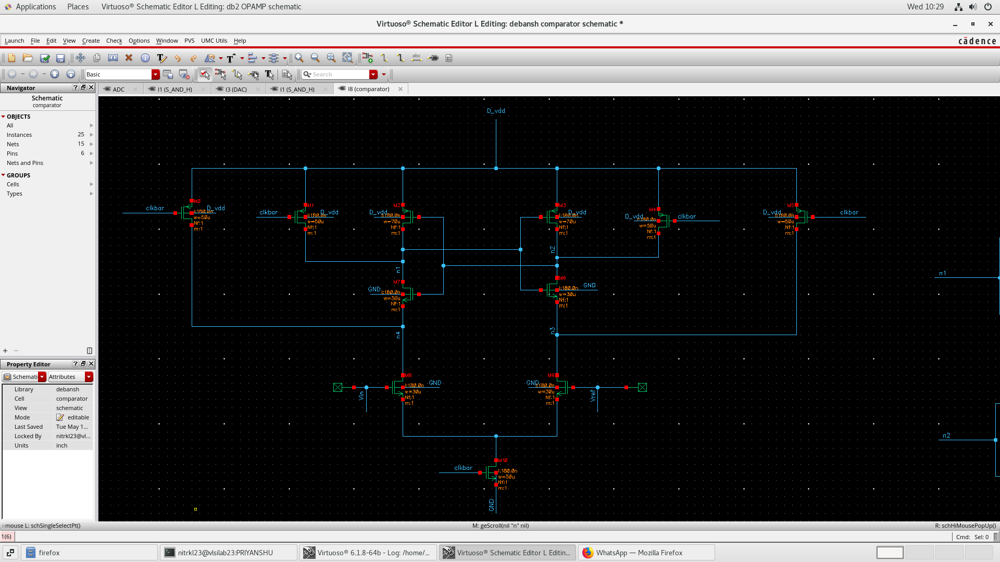
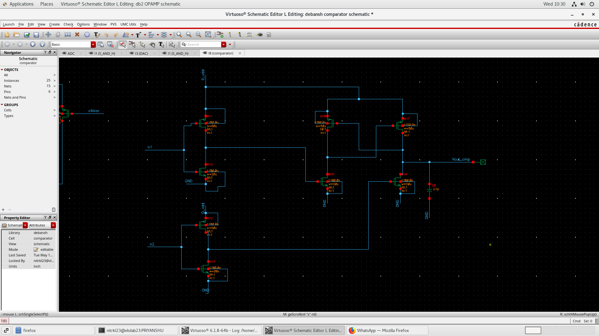
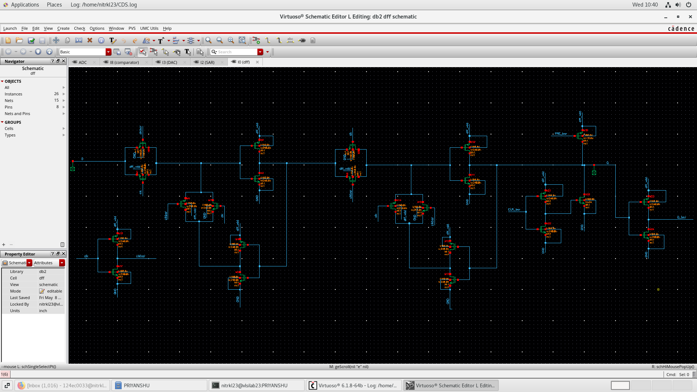
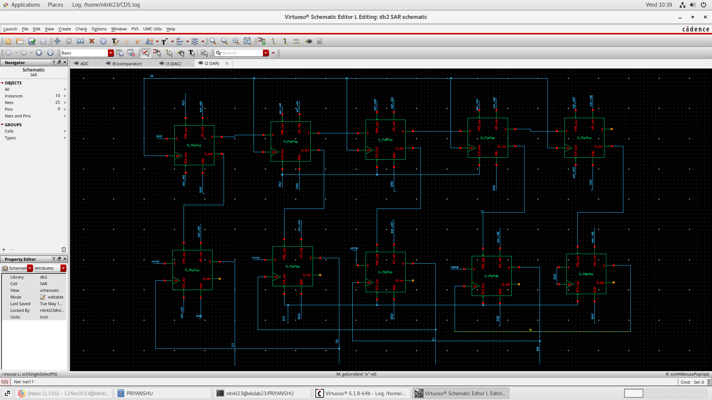
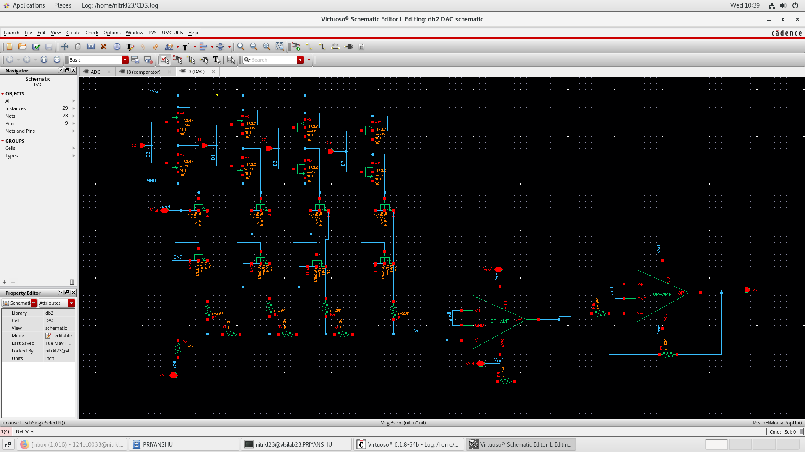
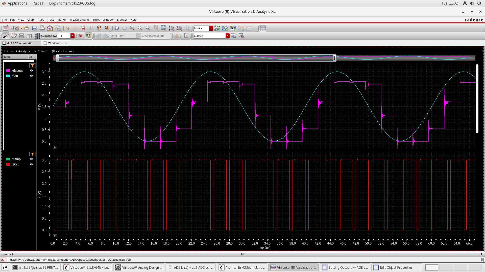
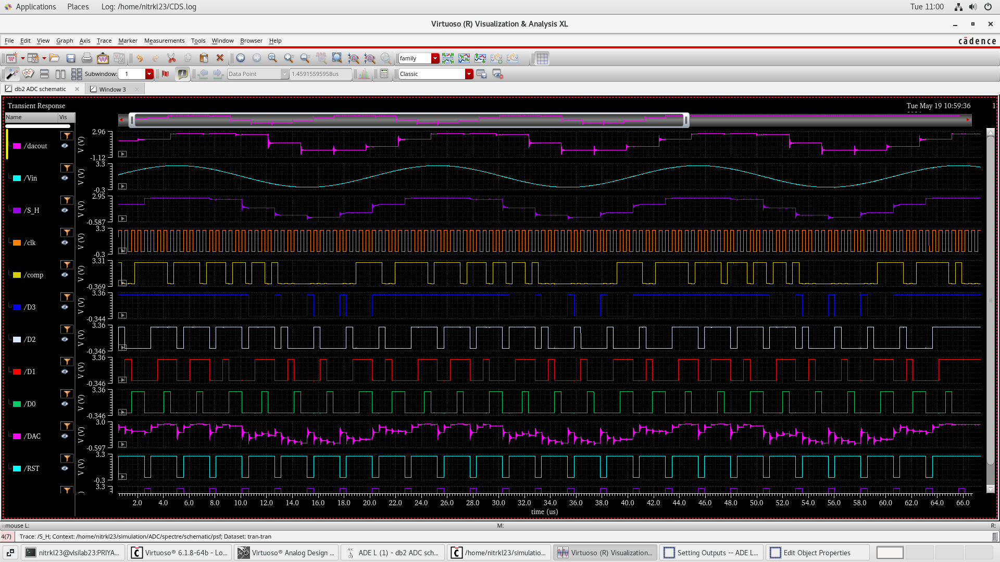

# 4-Bit SAR ADC Design Using Custom CMOS Logic in Cadence

Designed and simulated a fully custom 4-bit Successive Approximation Register (SAR) ADC using transistor-level CMOS circuits in Cadence Virtuoso.  
The project includes custom-designed Sample & Hold, Comparator, SAR Logic, D Flip-Flops, and R-2R DAC blocks with transient verification of complete ADC functionality.

---

# 1. Complete ADC Architecture

The full SAR ADC system was integrated using custom analog and digital building blocks.

### Included Blocks
- Sample & Hold Circuit
- Comparator
- SAR Logic
- D Flip-Flops
- R-2R DAC
- Clock and Reset Control

---

# 2. Sample and Hold Circuit

A Sample & Hold (S/H) circuit was designed to sample the analog input before conversion.

### Observation
- Analog input was sampled and held during conversion.
- Op-amp buffering improved signal stability.

---

# 3. Dynamic Comparator Design

A clocked comparator was designed using transistor-level CMOS implementation.

## Comparator Core

---

## Comparator Output Stage

### Features
- Dynamic clocked operation
- Negative-edge triggered comparison
- CMOS regenerative structure
- Fast decision making during SAR conversion

---

# 4. D Flip-Flop Design

Custom D Flip-Flops were designed using basic NMOS and PMOS transistors for SAR register implementation.

### Observation
- Positive-edge triggered operation
- Used for sequential SAR bit storage
- Fully transistor-level implementation

---

# 5. SAR Logic Design

The SAR control logic was implemented using cascaded D Flip-Flops and control circuitry.

### Features
- Bit-by-bit successive approximation
- Positive-edge triggered SAR updates
- Sequential MSB-to-LSB conversion process

---

# 6. R-2R DAC Design

A 4-bit R-2R ladder DAC was implemented for analog voltage generation during SAR conversion.

### Observation
- DAC generated reference voltages based on SAR outputs
- Ladder structure provided binary-weighted analog output
- Op-amp stage used for signal conditioning and buffering

---

# 7. DAC Output for Sampled Inputs

DAC output behavior was verified against varying sampled analog inputs.

### Observation
- DAC output followed quantized analog levels
- Stepwise approximation behavior observed clearly

---

# 8. Complete ADC Transient Simulation

Full ADC transient simulation was performed to verify overall conversion operation.

### Signals Verified
- Analog Input
- Sample & Hold Output
- Comparator Output
- Clock Signal
- SAR Register Outputs (D3-D0)
- DAC Output
- Reset Signal

### Observation
- Successful bit-by-bit SAR conversion achieved
- Digital outputs updated sequentially
- DAC and comparator interaction verified successfully

---

# Working Principle

1. The analog input signal is sampled using the Sample & Hold circuit.
2. SAR logic begins approximation from the MSB.
3. The R-2R DAC generates corresponding analog reference voltages.
4. Comparator compares sampled input with DAC output.
5. Comparator output updates SAR register bits sequentially.
6. Final 4-bit digital code represents the analog input voltage.

---

# Clocking Strategy

- Comparator operates on negative clock edge
- SAR logic updates on positive clock edge

This timing separation improves synchronization between analog and digital sections.

---

# Tools Used

- Cadence Virtuoso
- Spectre Simulator
- Analog Design Environment (ADE)

---

# Key Features

- Fully Custom 4-Bit SAR ADC
- Transistor-Level CMOS Design
- Custom Dynamic Comparator
- D Flip-Flop Based SAR Logic
- R-2R Ladder DAC
- Sample & Hold Circuit
- Positive and Negative Edge Clock Synchronization
- Mixed-Signal Integration
- Transient Analysis Verification

---

# Learning Outcomes

This project provided practical understanding of:

- SAR ADC Architecture
- Analog and Digital CMOS Design
- Comparator Design
- Clock Synchronization
- R-2R DAC Operation
- Sequential SAR Approximation
- Mixed-Signal Simulation in Cadence
- Transient Analysis and Debugging

---

# Future Improvements

- Increase ADC resolution
- Optimize conversion speed
- Reduce power consumption
- Perform DNL/INL analysis
- Add layout and post-layout simulations
- Implement asynchronous SAR architecture

---

# Conclusion

Successfully designed and simulated a fully custom 4-bit SAR ADC using transistor-level CMOS logic in Cadence Virtuoso.  
All major analog and digital building blocks were integrated and verified through transient simulations, demonstrating successful analog-to-digital conversion functionality.

---

# Author

Designed and simulated as a student mixed-signal VLSI project using Cadence Virtuoso.
